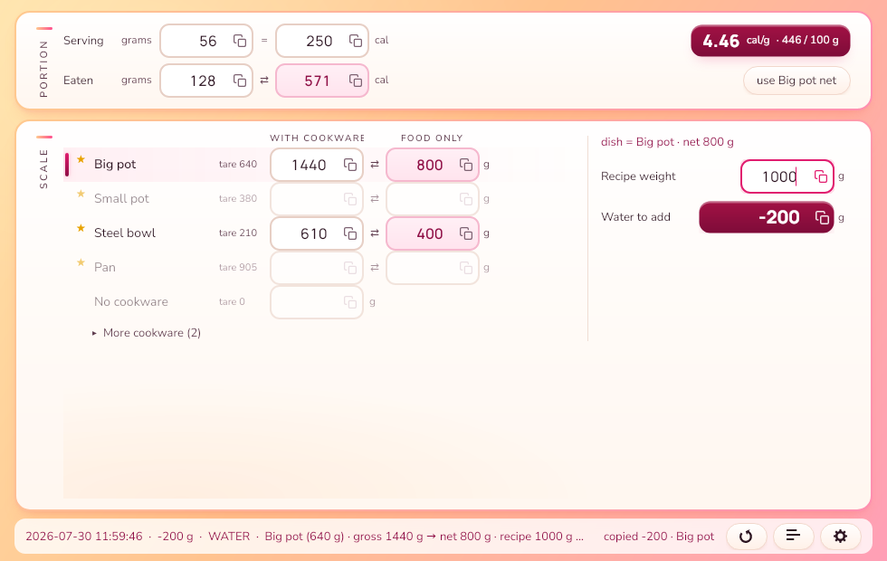
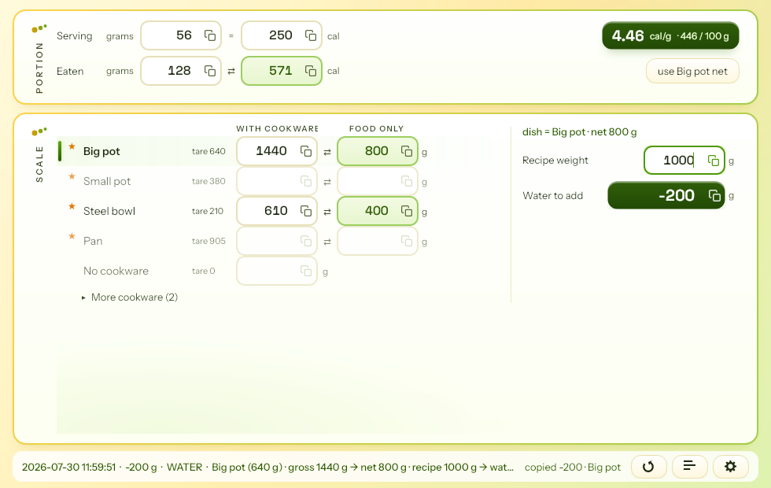
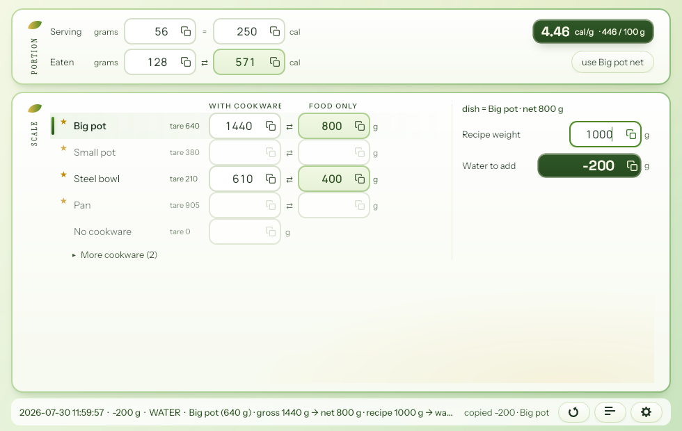
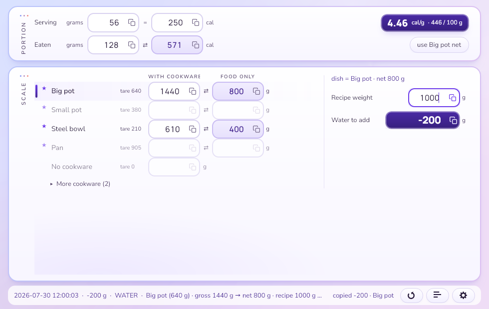
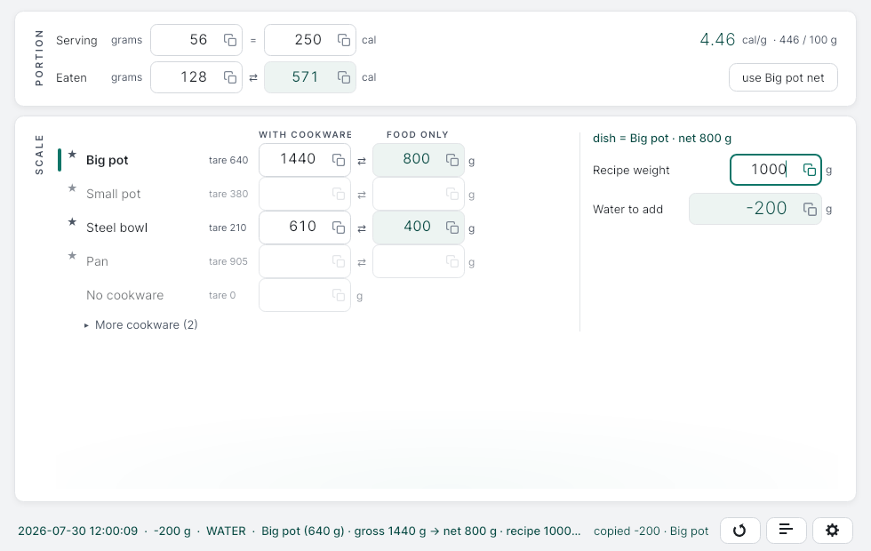
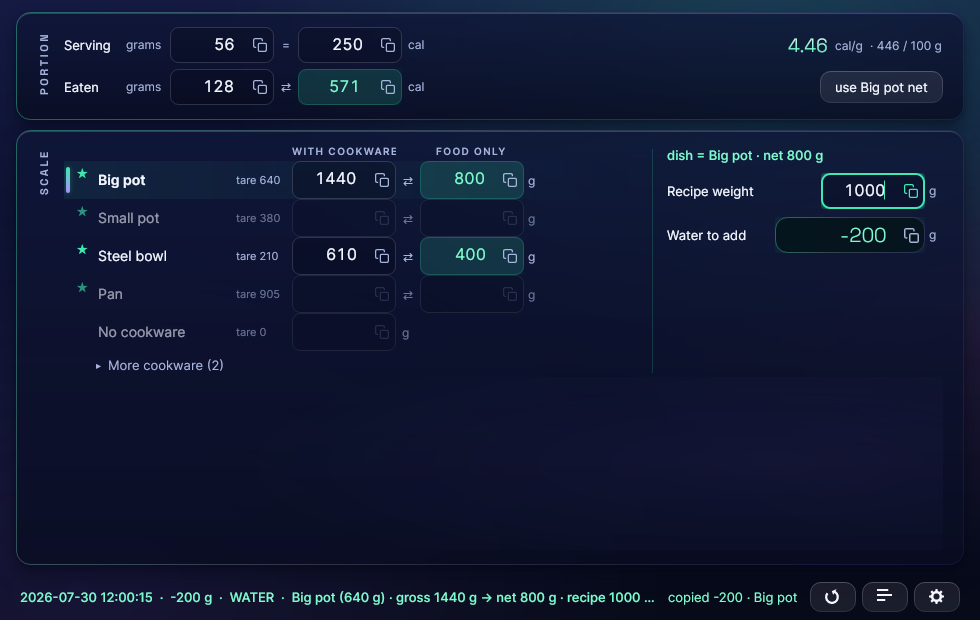
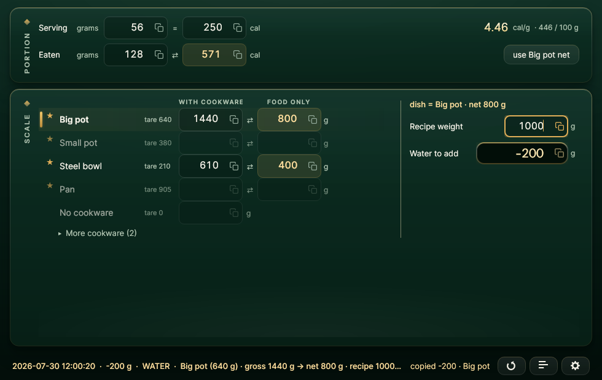

# ZFood

Fast gram-and-calorie arithmetic for people who log their food in a nutrition
tracker. ZFood replaces the hand calculator you reach for while cooking: label
math for portions, tare math for cookware on a kitchen scale, and the water
adjustment that reconciles a recipe's ingredient total with what the cooked
dish actually weighs. One window, instant recalculation on every keystroke,
and every result one keypress away from the clipboard.

ZFood is a companion calculator, not a tracker itself. It sits next to a
nutrition tracker such as [Cronometer](https://cronometer.com/) and helps you
get the numbers right before you enter them: the weight of the food on your
scale, the calories in the portion you just ate, and the corrected weight of
a cooked recipe.


## The three tools

- **Portion.** Type a label's serving (grams and calories) and either how many
  grams you ate or how many calories you have left; the other side computes
  instantly. The calorie density (cal/g and cal/100 g) is always visible, handy
  for comparing products in the store.
- **Scale.** Each pinned cookware item is its own row. Type the scale reading
  next to it to see the net food weight (or type the net weight you want and
  pour until the scale shows the target). Several rows can hold readings at
  once; rarely used cookware sits behind "More cookware".
- **Water.** Type the recipe's ingredient total and ZFood shows the signed
  "tap water" weight that reconciles it with the cooked dish, computed straight
  from the cookware row you last used, no retyping. Copy puts the bare number
  (for example `-200`) on the clipboard, ready to paste into your tracker.

A log keeps completed calculations for two weeks, so a number you forgot to
enter into your tracker is never lost: the Log button opens it, and clicking
any row copies its result. The status line at the bottom always shows the
newest entry and copies its result on click. Results reach the clipboard
without any extra action at all: while you type, the freshly computed partner
value (the net weight, the calories, the water number) is placed on the
clipboard on every recompute, so finishing typing means the result is already
pasteable. Every field also carries a small copy icon, and focusing a field
that holds a number copies it too.

## Download

Prebuilt self-contained executables for Linux x64 and Windows x64 are on the
[releases page](https://github.com/zoffixznet/zfood/releases). Download the
archive for your platform, unpack it, and run the executable inside; there is
nothing else to install.

## Build from source

The same executables can be produced from a checkout:

```sh
make deps           # Debian/Ubuntu: install any missing system tools via apt
make setup          # one-time: installs a project-local .NET SDK if needed
make run            # build and start the app
make publish-linux  # dist/linux-x64/ZFood     (single file)
make publish-win    # dist/win-x64/ZFood.exe   (single file)
```

`make deps` checks for the system tools the other targets use (curl, Xvfb,
xdotool, ImageMagick), tells you what is missing, and runs the `apt-get`
install line it prints, so sudo can ask for your password. `make setup` only
downloads an SDK when no usable `dotnet` is on your PATH, and keeps it inside
the project directory. On Windows, install the
[.NET 8 SDK](https://dotnet.microsoft.com/download) and use the equivalent
commands directly: `dotnet run --project src/ZFood.App`.

## Working with it

Everything on the core path works with single keypresses and single clicks,
because cooking hands are messy hands:

- **Digits** type into the focused field; every field selects its content on
  focus, so typing over a stale value costs nothing.
- **Tab** and **Up/Down** walk the fields.
- **Click** anywhere on a cookware row to focus it; typing into a row is what
  makes it the "dish" feeding the water calculation.
- **Enter** in a cookware row commits the calculation and jumps to the recipe
  field; **Enter** in the recipe field commits and copies the water number.
- **Esc** clears the focused field, or closes the log view when it is open.
  **Reset** (or Ctrl+R) clears every number at once; the log keeps anything
  worth remembering.

Optional accelerators for desk use: Ctrl+1..9 jump to cookware rows (Ctrl+0
the no-cookware row), Alt+P serving grams, Alt+R recipe weight, Alt+M more
cookware, Ctrl+L the log, Ctrl+Enter copy.

While a recipe weight is present, the binding between cookware rows and the
water calculation never moves just because you typed in another row; only an
explicit act (Enter, a click, an accelerator) re-targets it, and the change is
announced visibly.

## Cookware

The gear icon (bottom right) opens the settings dialog: the theme picker on
top and the cookware list below it. New cookware is entered in the add row
under the list (name, weight, Add); selecting a list item opens it in the
editor beside the list for renaming, re-weighing, pinning, ordering, or
deleting. Pinned items (up to five) are always visible as rows; everything
else waits behind "More cookware". The permanent "No cookware" row covers
dishes weighed directly on the scale.


## Configuration

All data lives in one per-user folder, `ZFood` inside your platform's
application-data directory: `~/.config/ZFood` on Linux, `%APPDATA%\ZFood` on
Windows. It holds `settings.json` (window geometry, cookware, theme),
`log.jsonl` (the calculation log, pruned to 14 days / 500 entries), and
`diagnostics.log`.
Set the `ZFOOD_DATA_DIR` environment variable to keep the data somewhere else.
Damaged files are moved aside with a `.bak` suffix and replaced with defaults;
the app never refuses to start over its own data.

## Building and testing

```sh
make              # list all targets
make test         # unit tests plus headless UI tests
make smoke        # launches the real binary on a private virtual display
make format       # code formatting
make icons        # regenerate icons from the SVG source
make screenshots  # regenerate the README screenshots from the running app
```

The smoke and screenshot targets need `Xvfb`, `xdotool`, and ImageMagick;
`make deps` installs them on Debian/Ubuntu.

## Themes

Seven visual themes ship with the app. Pick one in the settings dialog (gear
icon, bottom right); it applies instantly and is remembered across runs.

- **Juice Bar** (the default): a sunlit counter; cream cards on a
  mango-to-watermelon gradient, with the two hero readouts as glossy
  raspberry candy chips.

  

- **Limonata**: a lemonade stand; zest-edged white cards on a poured
  lemon-to-lime-fizz glass, with the heroes as deep lime hard candies.

  

- **Matcha Garden**: a greenhouse morning; milk-white cards with leaf-rind
  borders on a cream-to-sage wash, serif botanical labels, and the heroes as
  deep-glazed matcha bowls with a crema ring.

  

- **Berry Milk**: a pastel dessert bar; milk slabs on a
  periwinkle-to-lavender sky, with the heroes as blueberry candy buttons
  wearing a piped milk rim.

  

- **Porcelain**: a quiet, light instrument; white cards on cool porcelain
  with a single deep-teal accent.

  

- **Aurora**: smoked-glass panels under a northern-lights sky; computed
  values glow mint.

  

- **Glossy**: a jeweler's vitrine; dark bottle-green glass, brass bezels,
  and gold numerals lit by one warm lamp.

  

## Known limitations

- Grams and calories only: no unit conversion, no nutrition database, no
  macro tracking. ZFood feeds numbers to your tracker; it does not replace it.
- On Linux/X11, some window managers restore the remembered window position a
  few pixels off; the window always reappears fully on screen.
- The Windows executable is not code-signed, so SmartScreen may ask for
  confirmation on first launch.
- Both "." and "," are accepted as decimal separators on input, but copied
  values always use "." so they paste cleanly into trackers.

## License

MIT, see [LICENSE](LICENSE).
