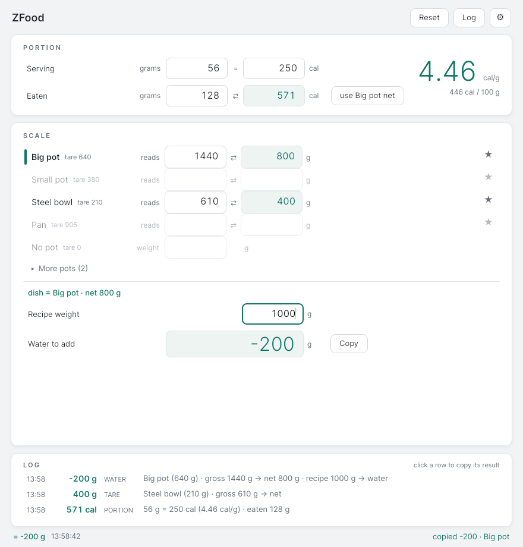
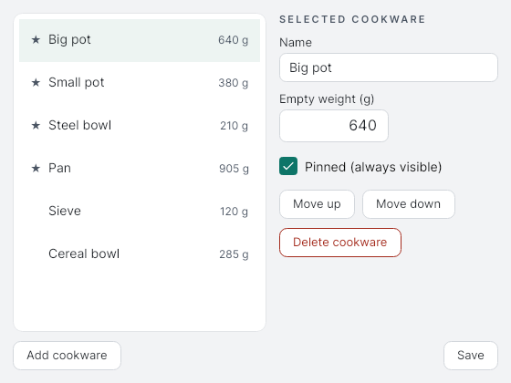

# ZFood

Fast gram-and-calorie arithmetic for people who log their food in a nutrition
tracker. ZFood replaces the hand calculator you reach for while cooking: label
math for portions, tare math for pots on a kitchen scale, and the water
adjustment that reconciles a recipe's ingredient total with what the cooked
dish actually weighs. One window, instant recalculation on every keystroke,
and every result one keypress away from the clipboard.



## The three tools

- **Portion.** Type a label's serving (grams and calories) and either how many
  grams you ate or how many calories you have left; the other side computes
  instantly. The calorie density (cal/g and cal/100 g) is always visible, handy
  for comparing products in the store.
- **Scale.** Each pinned pot is its own row. Type the scale reading next to a
  pot to see the net food weight (or type the net weight you want and pour
  until the scale shows the target). Several pots can hold readings at once;
  rarely used cookware sits behind "More pots".
- **Water.** Type the recipe's ingredient total and ZFood shows the signed
  "tap water" weight that reconciles it with the cooked dish, computed straight
  from the pot row you last used, no retyping. Copy puts the bare number
  (for example `-200`) on the clipboard, ready to paste into your tracker.

A log keeps completed calculations for two weeks, so a number you forgot to
enter into your tracker is never lost: click any log row to copy its result.

## Install and run

Prebuilt self-contained executables (no runtime required) can be produced from
a checkout, or grab them from a release if one is available:

```sh
make setup          # one-time: installs a project-local .NET SDK if needed
make run            # build and start the app
make publish-linux  # dist/linux-x64/ZFood     (single file)
make publish-win    # dist/win-x64/ZFood.exe   (single file)
```

`make setup` only downloads an SDK when no usable `dotnet` is on your PATH,
and keeps it inside the project directory. On Windows, install the
[.NET 8 SDK](https://dotnet.microsoft.com/download) and use the equivalent
commands directly: `dotnet run --project src/ZFood.App`.

## Working with it

Everything on the core path works with single keypresses and single clicks,
because cooking hands are messy hands:

- **Digits** type into the focused field; every field selects its content on
  focus, so typing over a stale value costs nothing.
- **Tab** and **Up/Down** walk the fields.
- **Click** anywhere on a pot row to focus it; typing into a row is what makes
  it the "dish" feeding the water calculation.
- **Enter** in a pot row commits the calculation and jumps to the recipe
  field; **Enter** in the recipe field commits and copies the water number.
- **Esc** clears the focused field. **Reset** (or Ctrl+R) clears every number
  at once; the log keeps anything worth remembering.

Optional accelerators for desk use: Ctrl+1..9 jump to pot rows (Ctrl+0 the
no-pot row), Alt+P serving grams, Alt+R recipe weight, Alt+M more pots,
Ctrl+L the log, Ctrl+Enter copy.

While a recipe weight is present, the binding between pot rows and the water
calculation never moves just because you typed in another row; only an
explicit act (Enter, a click, an accelerator) re-targets it, and the change is
announced visibly.

## Cookware

The gear icon (top right) opens the cookware list: name, empty weight, pinned
flag, and ordering. Pinned pots (up to five) are always visible as rows;
everything else waits behind "More pots". The permanent "No pot" row covers
dishes weighed directly on the scale.



## Configuration

All data lives in one per-user folder, `ZFood` inside your platform's
application-data directory: `~/.config/ZFood` on Linux, `%APPDATA%\ZFood` on
Windows. It holds `settings.json` (window geometry, cookware), `log.jsonl`
(the calculation log, pruned to 14 days / 500 entries), and `diagnostics.log`.
Set the `ZFOOD_DATA_DIR` environment variable to keep the data somewhere else.
Damaged files are moved aside with a `.bak` suffix and replaced with defaults;
the app never refuses to start over its own data.

## Building and testing

```sh
make            # list all targets
make test       # unit tests plus headless UI tests
make smoke      # launches the real binary on a private virtual display
make format     # code formatting
make icons      # regenerate icons from the SVG source
make screenshots# regenerate the README screenshots from the running app
```

The smoke and screenshot targets need `Xvfb`, `xdotool`, and ImageMagick.

## Known limitations

- Grams and calories only: no unit conversion, no nutrition database, no
  macro tracking. ZFood feeds numbers to your tracker; it does not replace it.
- On Linux/X11, some window managers restore the remembered window position a
  few pixels off; the window always reappears fully on screen.
- The Windows executable is not code-signed, so SmartScreen may ask for
  confirmation on first launch.
- Both "." and "," are accepted as decimal separators on input, but copied
  values always use "." so they paste cleanly into trackers.

## License

MIT, see [LICENSE](LICENSE).
